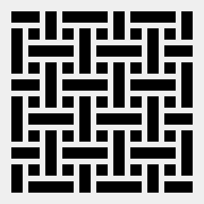
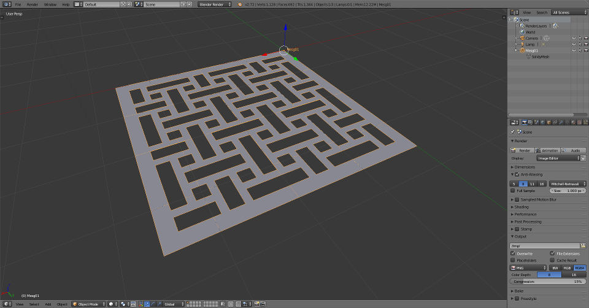

# image_mesh

Image mesh is a small script that loads an image and creates a blender
2D mesh of the same dimmension, where the dark parts of the image are
holes, and all the mesh edges are orthogonal. And because an image 
is worth a thousand words, first the the image used as the source for 
the script:



And the resulting blender mesh:



This script was created to render grids, so if you need a mesh that follows
a curved edge interpolating the mesh, it is not what you are looking for.

Usage
=====

The script is designed to be called without blender gui:

```bash
blender --background --python image_mesh.py -- /path/to/image.png
```

Once finished it will have create a new file named **output.blend** containing
the mesh.

